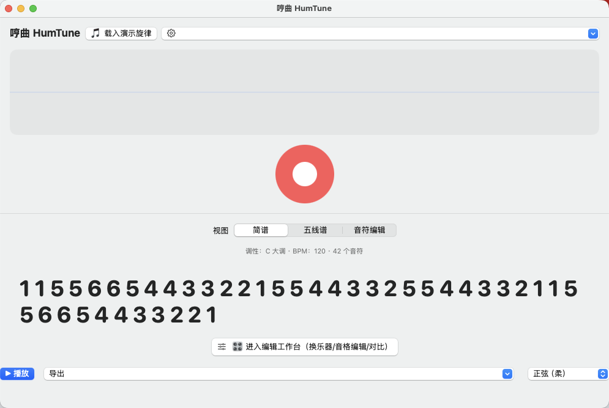
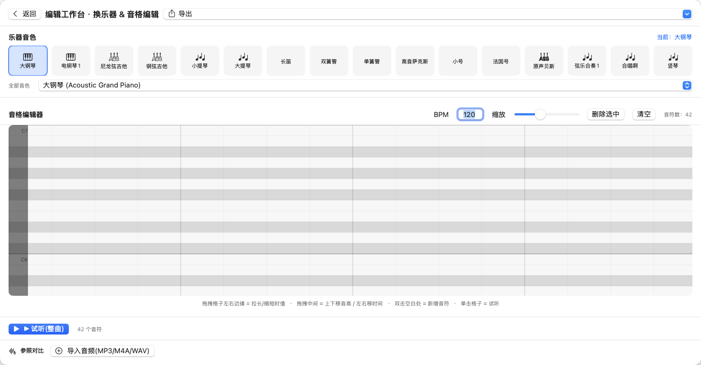

# 🎼 HumTune 哼曲 — 让所有人都参与到音乐创作中来，没有障碍

> **Music Creation for Everyone. Zero Barriers.**
> **誰でも音楽制作に参加できる。障壁ゼロ。**
> **누구나 음악 창작에 참여할 수 있다. 장벽 제로.**
> **讓所有人都參與到音樂創作中來，沒有障礙。**

哼一句旋律，就能把它变成可以播放、可以换乐器、可以一格一格编辑、可以导出 MIDI 的音乐作品。**不需要任何乐理知识，不需要任何乐器，只需要你的声音。**

---

## ✨ 为什么是 HumTune？

| 别人 | HumTune |
|------|---------|
| 哼歌搜歌（SoundHound）→ 只告诉你这是哪首歌，出不了谱 | 哼歌 → **直接出简谱 + 五线谱 + MIDI** |
| 音频转 MIDI（Basic Pitch）→ 出了 MIDI 却看不懂 | 出谱**还带易读的简谱**，中国人秒懂 |
| 专业 DAW（Logic/Cubase）→ 复杂、昂贵、学不会 | **打开即玩**，一个红色按钮就是全部 |

**HumTune 补上了那个空白**：从"哼唱"到"可以带走的音乐"之间的整条路。

---

## 🎁 你能做什么

1. 🎤 **哼一句** — 按下大红按钮，对着麦克风哼唱
2. 🎼 **自动出谱** — 简谱 + 五线谱 + 可编辑 MIDI 三合一
3. 🎹 **换乐器** — 44 种精选 + 128 种 GM 乐器，钢琴/小提琴/长笛/萨克斯… 点一下，立即听到真实乐器音色
4. ✏️ **音格编辑** — 专业钢琴卷帘，拖拽抬音高、拉长时值，一格一格改到满意
5. 🔍 **参照对比** — 导入 MP3/M4A/WAV，和你的旋律 A/B 比对
6. 💾 **导出带走** — MIDI / MusicXML / 音频 / 简谱文本，一条龙

---

## 📸 界面一览

### 主界面（打开就有一首《小星星》示范，零门槛）

### 编辑工作台（换乐器 + 音格编辑 + 参照对比）

---

## 🚀 快速开始

### 方式一：直接运行（最快）
1. 下载 `HumTune-3.0.0-macOS.zip`
2. 解压，把 `HumTune.app` 拖进「应用程序」文件夹
3. 双击打开，开始哼唱

### 方式二：安装包
1. 下载 `HumTune-3.0.0.dmg`
2. 打开 DMG，把 app 拖入 Applications
3. 完成

> 需要 macOS 14.0 或更高版本。首次打开若提示"无法验证开发者"，右键 → 打开 → 确认。

---

## 🛠 技术栈

- **纯 Swift / SwiftUI** 原生，零外部依赖，装机即用
- **YIN 音高检测引擎**（亚半音精度，误差 < 30 音分）
- **AVAudioUnitSampler + 系统 GM 音色库**（128 种真实乐器音色）
- **自研 SMF MIDI 写入器** + MusicXML 导出

---

## 📄 许可证

MIT License — 详见 [LICENSE](LICENSE)

---

*哼一句，就是创作。* 🎵

---

# 🎼 哼曲 HumTune — 讓所有人都參與到音樂創作中來，沒有障礙

哼一句旋律，就能把它變成可以播放、可以換樂器、可以一格一格編輯、可以匯出 MIDI 的音樂作品。**不需要任何樂理知識，不需要任何樂器，只需要你的聲音。**

| 別人 | HumTune |
|------|---------|
| 哼歌搜歌 → 只告訴你這是哪首歌 | 哼歌 → **直接出簡譜 + 五線譜 + MIDI** |
| 音頻轉 MIDI → 出了 MIDI 卻看不懂 | 出譜**還帶易讀的簡譜** |
| 專業 DAW → 複雜、昂貴、學不會 | **打開即玩**，一個紅色按鈕就是全部 |

🎤 哼一句 → 🎼 自動出譜 → 🎹 換樂器 → ✏️ 音格編輯 → 💾 匯出 MIDI/MusicXML/音頻。

**快速開始**：下載 `HumTune-3.0.0-macOS.zip` 解壓直接運行，或下載 `HumTune-3.0.0.dmg` 安裝。需 macOS 14.0+。

---

# 🎼 HumTune — Music Creation for Everyone, Zero Barriers

Hum a melody, and HumTune turns it into playable, editable, exportable music. **No music theory. No instruments. Just your voice.**

| Others | HumTune |
|--------|---------|
| Hum-to-search → only tells you the song name | Hum → **get Jianpu + Sheet Music + MIDI instantly** |
| Audio-to-MIDI → unreadable output | **Readable notation** included |
| Pro DAWs → complex, expensive | **Open and play** — one red button is all you need |

🎤 Hum → 🎼 Auto-transcribe → 🎹 Switch instruments (128 GM sounds) → ✏️ Piano-roll editing → 💾 Export MIDI/MusicXML/Audio.

**Quick start**: Download `HumTune-3.0.0-macOS.zip`, unzip and run — or `HumTune-3.0.0.dmg` to install. Requires macOS 14.0+.

---

# 🎼 HumTune — 誰でも音楽制作に参加できる、障壁ゼロ

メロディーをハミングするだけで、再生も楽器切替も、一マスずつの編集も、MIDI 書き出しもできる音楽作品に変身。**楽譜の知識も楽器も不要。必要なのはあなたの声だけ。**

| 他サービス | HumTune |
|-----------|---------|
| ハミング検索 → 曲名しか分からない | ハミング → **楽譜（数字譜・五線譜）+ MIDI を即生成** |
| 音声→MIDI → 読めない出力 | **読みやすい楽譜付き** |
| プロ向け DAW → 複雑で高額 | **開くだけで遊べる**、赤いボタンが全て |

🎤 ハミング → 🎼 自動採譜 → 🎹 楽器切替（128 音色）→ ✏️ ピアノロール編集 → 💾 MIDI/MusicXML/音声を書き出し。

**クイックスタート**：`HumTune-3.0.0-macOS.zip` を解凍してそのまま実行、または `HumTune-3.0.0.dmg` でインストール。macOS 14.0+ が必要です。

---

# 🎼 HumTune — 누구나 음악 창작에 참여할 수 있다, 장벽 제로

멜로디를 흥얼거리기만 하면, 재생·악기 변경·한 칸씩 편집·MIDI 내보내기가 가능한 음악 작품으로 변신합니다. **악보 지식도, 악기도 필요 없습니다. 오직 당신의 목소리만 있으면 됩니다.**

| 다른 서비스 | HumTune |
|-----------|---------|
| 허밍 검색 → 곡명만 알려줌 | 허밍 → **악보(숫자보·오선보) + MIDI 즉시 생성** |
| 오디오→MIDI → 읽기 어려운 출력 | **읽기 쉬운 악보 포함** |
| 전문 DAW → 복잡하고 비쌈 | **열면 바로**, 빨간 버튼이 전부 |

🎤 허밍 → 🎼 자동 채보 → 🎹 악기 변경(128 음색) → ✏️ 피아노 롤 편집 → 💾 MIDI/MusicXML/오디오 내보내기.

**빠른 시작**: `HumTune-3.0.0-macOS.zip`을 압축 해제해 바로 실행하거나, `HumTune-3.0.0.dmg`로 설치하세요. macOS 14.0+ 필요.